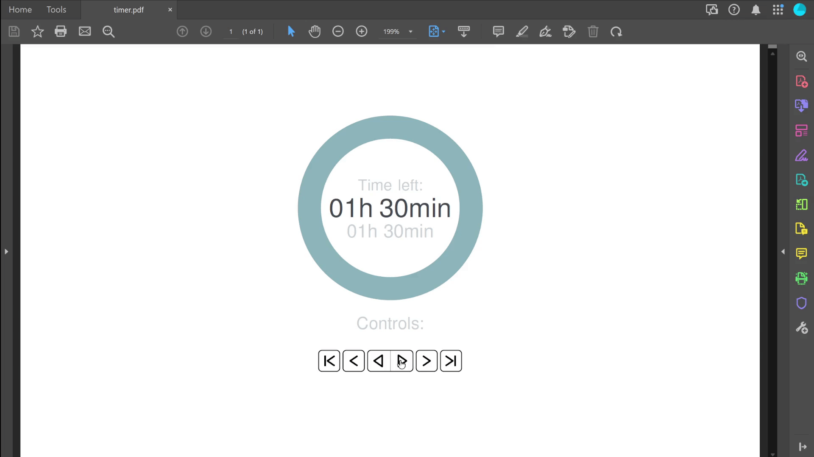

# LaTeX-Beamer-Timer

LaTeX-Beamer-Timer is a small LaTeX code snippet that enables the seamless integration of an animated timer into a presentation.

Initially, I created this timer to offer students a more precise time reference during exams, replacing the practice of drawing 15-minute intervals on the blackboard. However, the timer can also be utilized for various other scenarios. 

## Reader compatibility

To use the timer, the PDF reader must support JavaScript-driven animations.

Here is a small list of tested compatible/not compatible readers:

### Compatible

LaTeX-Beamer-Timer has been tested and found compatible with the following PDF readers:

| PDF Reader | Operating System | Tested Version |
| --- | --- | --- |
| Adobe Acrobat Pro | Windows 11 Pro | 22.003.20322 |
| Okular | Debian 11 | 20.12.3 |

It is reasonable to assume that the compatible PDF readers should work regardless of the operating system and version, as long as they are newer than the tested versions. 

### Not Compatible

LaTeX-Beamer-Timer has been found to be incompatible with the following PDF reader:

| PDF Reader | Operating System | Tested Version |
| --- | --- | --- |
| Google Chrome | Windows 11 Pro | 110.0.5481.178 |

